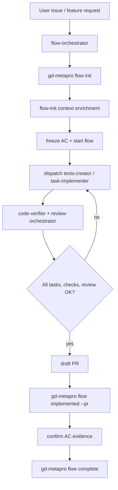

# Flow Orchestrator

## Purpose

Flow Orchestrator is the Task Manager-aware implementation orchestrator.
It wraps the existing gdskills pipeline with `gd-metapro flow` state.

Use this skill instead of `job-orchestrator` when the user wants a managed
story/issue lifecycle with frozen acceptance criteria, task state, draft PR
gates, Code Health, and a durable flow package in `.metaproject/flows/`.

Do not modify `job-orchestrator` or `task-implementer` behavior. They remain
usable without Task Manager. This skill coordinates them through flow state.

## Hard Preconditions

1. Read `.metaproject/index.md` and `.metaproject/metaproject.json`.
2. Confirm Task Manager is enabled:
   - `.metaproject/metaproject.json` must contain `modules.tasks.enabled: true`;
   - `.metaproject/skills/flow/SKILL.md` should exist.
3. If Task Manager is not enabled, stop and tell the user to run:

```bash
gd-metapro update
```

or initialize with the Task Manager module enabled. Do not emulate flow state by
hand.

## Source Of Truth

Flow state lives in `.metaproject/flows/<flow-id>/`.

CLI-owned files:

- `flow.json` - never edit by hand.
- status transitions - only through `gd-metapro flow ...`.
- task status - only through `gd-metapro flow task done ...`.
- frozen acceptance criteria changes - only through
  `gd-metapro flow ac update <id> --reason "<why>"`.

Agent-editable files:

- `description.md`
- `context.md`
- `plan.md`
- `tasks.md` for task definitions only
- `journal.md`

## Lifecycle



## Phase 0: Route And Resume

1. Run `gd-metapro flow list`.
2. If an active flow obviously matches the user request, use it.
3. If multiple active flows could match, ask one concise question.
4. If no flow exists and the request is multi-step, create one:

```bash
gd-metapro flow init --issue <url>
```

or:

```bash
gd-metapro flow init --title "<short formalized problem>"
```

5. Run `gd-metapro flow status <id>` and read the flow package.

## Phase 1: Initialize The Flow Package

Use `.metaproject/skills/flow/init.md` as the local flow-init procedure.

Required context sources:

- gdgraph for impacted files and dependency relationships;
- gdctx for compact command/search/diff output;
- gdwiki for architecture, domain rules, business behavior and decisions;
- memory for lessons learned, repeated failures and historical constraints;
- health/testing reports for baseline risk.

Required rules:

- `.metaproject/rules/core/requirements-management.mdc`
- `.metaproject/rules/core/implementation-plans.mdc`
- `.metaproject/rules/core/subagent-context-construction.md`
- `.metaproject/rules/core/tdd-workflow.mdc`
- `.metaproject/rules/core/code-style-patterns.mdc`
- `.metaproject/rules/core/error-handling.mdc`
- `.metaproject/rules/core/implementation-doc-mandate.mdc`

Write or update:

- `description.md` - problem, expected outcome, out of scope;
- `context.md` - compact links and findings, not raw dumps;
- `plan.md` - chosen approach and trade-offs;
- `tasks.md` - task definitions grouped by context, test, implement, review, docs;
- `acceptance-criteria.md` - verifiable `ACn` criteria.

Then freeze and start:

```bash
gd-metapro flow freeze <id>
gd-metapro flow start <id>
```

## Phase 2: Execute Tasks

Use existing gdskills as workers. Do not duplicate their internal workflows.

Recommended worker routing:

| Flow task kind | Worker skill |
|---|---|
| `context` | `context-collector` |
| `test` | `tests-creator` or `test-gen` |
| `implement` | `task-implementer` |
| `review` | `review-orchestrator` |
| `docs` | `job-documenter`, `prd-creator`, or documentation-specific project skill |

For every worker dispatch, pass only compact task context:

```text
FLOW_ID: <id>
FLOW_DIR: .metaproject/flows/<dir>
TASK_ID: <Tn>
TASK_KIND: <context|test|implement|review|docs>
CONTEXT_PATH: .metaproject/flows/<dir>/context.md
PLAN_PATH: .metaproject/flows/<dir>/plan.md
AC_PATH: .metaproject/flows/<dir>/acceptance-criteria.md
RULES:
- <only the relevant .metaproject/rules/core files>
CONSTRAINTS:
- Never edit flow.json.
- Never edit frozen acceptance criteria directly.
- Return a compact result with files changed, verification, and risks.
```

After a worker succeeds, the flow-orchestrator marks task progress:

```bash
gd-metapro flow task done <id> <Tn>
```

If new work is discovered:

```bash
gd-metapro flow task add <id> --title "<task>" --kind <kind>
```

## Phase 3: Verification And Review

Before accepting implementation:

1. Run focused tests for touched scope.
2. Run `code-verifier`.
3. Run `gd-metapro health run` when Code Health is enabled.
4. Run `review-orchestrator` with relevant domains.
5. If findings require code changes, dispatch fix work through `task-implementer`
   and record the fix task in the flow.

The implementer never self-accepts. Only flow-orchestrator decides whether the
flow can move to `implemented`.

## Phase 4: Draft PR Gate

When tasks, verification and review are complete:

1. Create or confirm a draft PR in the author's name.
2. Record it through the CLI:

```bash
gd-metapro flow implemented <id> --pr <draft-pr-url>
```

Do not run `flow implemented` without a PR URL. If the user explicitly asks to
skip PR creation, keep the flow in progress and explain that Task Manager's
completion gate requires a PR record.

## Phase 5: Complete The Flow

Use `.metaproject/skills/flow/complete.md`.

For every acceptance criterion, verify evidence and confirm:

```bash
gd-metapro flow ac confirm <id> ACn --note "<evidence>"
```

Then run:

```bash
gd-metapro flow complete <id>
```

If gates fail, the CLI returns the flow to `in-progress`. Add a journal note,
create fix tasks, and repeat Phase 2.

## Completion Report

Finish with:

- flow id and final status;
- PR URL;
- tasks completed;
- acceptance criteria evidence summary;
- verification/review results;
- unresolved risks or blocked gates.

## Boundaries

- Do not replace `job-orchestrator`. This is the Task Manager variant.
- Do not bypass the flow CLI for state changes.
- Do not let `task-implementer` edit `flow.json`, frozen AC, or decide
  completion.
- Do not read broad source trees when gdgraph/gdctx/wiki/memory can first
  narrow context.
