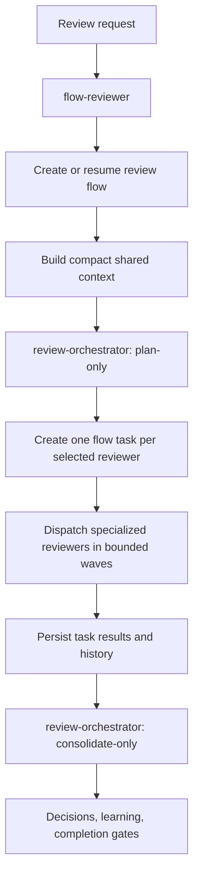

# Flow Reviewer Specification
Version: 0.1.0

## Identity

- Capability: Task Manager-aware review orchestration.
- Canonical skill: `gdskills/review/flow-reviewer`.
- Stateless engine: `gdskills/review/review-orchestrator`.
- State owner: `tasks` / `keryx flow`.
- Status: future; specification ready.

## Responsibility Model

| Component | Owns | Must not own |
|---|---|---|
| `review-orchestrator` | Scope detection, reviewer selection, dispatch contract construction, finding normalization, deduplication, consolidation | Flow creation, durable task state, retries across sessions, flow completion |
| `flow-reviewer` | Review flow lifecycle, one task per reviewer, model/budget policy, attempts, resume, artifacts, decisions, completion | Specialized review logic or duplicated reviewer-routing rules |
| Specialized reviewer | One bounded review domain and schema-valid findings | Cross-reviewer consolidation or flow state |
| Task Manager | Flow/task state transitions and immutable history | Review-domain decisions |
| `flow-orchestrator` | Implementation lifecycle and embedded review gate | Standalone managed review lifecycle |



## Storage Structure

A standalone managed review uses a normal flow package:

```text
.metaproject/flows/<flow-id>-<date>-review-<target>/
  flow.json                         # CLI-owned
  description.md
  context.md                        # compact summary and artifact links
  plan.md
  tasks.md
  acceptance-criteria.md            # frozen through keryx flow
  journal.md
  review/
    input.json
    execution-plan.json
    context-manifest.json
    coverage.md
    report.md
    findings.json
    decisions.md
    learning.md
    output.json
    tasks/
      <task-id>-<reviewer>/
        task.json
        events.jsonl
        attempts/
          001/
            dispatch.json
            result.json
            findings.json
```

`flow.json` and task status remain CLI-owned. Review-specific artifacts are
agent-written only after schema validation and atomic file replacement.

## Planned Skill Surface

Natural-language triggers include `flow review`, `managed review`,
`review with task tracking`, `review flow`, and `flow-reviewer`.

Planned agent input follows
[flow-reviewer-input.schema.json](schemas/flow-reviewer-input.schema.json).

Example:

```json
{
  "schemaVersion": 1,
  "target": { "kind": "pr", "ref": "https://github.com/acme/repo/pull/42" },
  "reviewerSelection": { "mode": "auto", "include": [], "exclude": [] },
  "modelPolicy": { "strategy": "adaptive", "preferEconomy": true },
  "contextPolicy": { "mode": "light", "reuseByHash": true },
  "budget": { "totalPromptTokens": 60000, "perReviewerPromptTokens": 10000 },
  "strict": "auto"
}
```

## Planned CLI Surface

Exact CLI spelling may be adjusted during implementation, but the following
user-level operations are required:

```text
keryx review flow start --target <kind> --ref <ref> [options]
keryx review flow resume <flow-id>
keryx review flow status <flow-id>
keryx review flow retry <flow-id> <task-id>
keryx review flow complete <flow-id>
```

Generic Task Manager must support review task transitions through CLI/service
operations. If generic commands are introduced, the preferred surface is:

```text
keryx flow task start <flow-id> <task-id>
keryx flow task done <flow-id> <task-id>
keryx flow task fail <flow-id> <task-id> --reason <reason>
keryx flow task retry <flow-id> <task-id>
keryx flow task skip <flow-id> <task-id> --reason <reason>
```

The underlying flow initialization must support an explicit review kind or
completion policy, for example:

```text
keryx flow init --kind review --title "Review <target>"
```

## Review Flow Completion Policy

Current implementation flows require a recorded draft PR before completion.
That gate is inappropriate for a review flow whose target may already be a PR.
Task Manager must add a backward-compatible flow discriminator:

```text
kind: implementation | review
```

Existing flows without `kind` migrate logically to `implementation`. A `review`
flow completes when reviewer task coverage, required artifacts, schema checks,
finding decisions, and acceptance evidence pass. It does not require creating a
new PR. Implementation flow completion and its PR gate remain unchanged.

## Review-Orchestrator Extension

`flow-reviewer` must compose, not clone, `review-orchestrator`. The stateless
engine therefore needs two explicit entry points:

### `plan-only`

Inputs: target, scope hints, flags, conventions policy, risk policy, context
references, token budget, and model strategy.

Output: a schema-valid
[review-execution-plan.json](schemas/review-execution-plan.schema.json) with:

- selected reviewers and reasons;
- skipped reviewers and reasons;
- domain-filtered file/context references;
- task ids and dependencies;
- model classes and budgets;
- strict-synthesis conditions.

### `consolidate-only`

Inputs: the execution plan and schema-valid reviewer results.

Output: normalized findings, deduplication decisions, coverage, consolidated
report, strict-synthesis result when required, and learning candidates.

The existing one-shot `review-orchestrator` behavior remains available by
running plan, dispatch, and consolidate in memory without Task Manager.

## Lifecycle

1. Resolve or create a dedicated review flow.
2. Collect target metadata and calculate a stable scope fingerprint.
3. Build a shared context manifest from graph, compact context, wiki, memory,
   testing, and health artifacts.
4. Call `review-orchestrator` in `plan-only` mode.
5. Validate the execution plan.
6. Add one `review` flow task per selected reviewer and freeze acceptance
   criteria before dispatch.
7. Reserve total and per-task budgets before launching a bounded parallel wave.
8. Write and validate a `subagent-dispatch` for each task.
9. Persist each `subagent-result`, reviewer findings, attempt metadata, and
   events before changing task status.
10. Re-dispatch `NEEDS_CONTEXT` with incremental references only.
11. Retry execution failures once by default; further retries require policy or
    user approval.
12. Call `review-orchestrator` in `consolidate-only` mode.
13. Persist coverage, report, findings, decisions, learning, and output.
14. Confirm acceptance criteria and complete the flow only after gates pass.

## Reviewer Task Mapping

- Selected reviewers create tasks; skipped reviewers create coverage entries.
- Task ids are stable within a flow and map one-to-one to reviewer names.
- A task may have multiple attempts, but only one terminal accepted result.
- Task history records every start, result, retry, context request, failure,
  skip, and completion event.
- Findings always retain `reviewer`, `dispatch_id`, and attempt provenance.

The durable task record follows
[reviewer-task-record.schema.json](schemas/reviewer-task-record.schema.json).
Worker communication reuses:

- `.metaproject/core/gdskills/contracts/subagent-dispatch.schema.json`;
- `.metaproject/core/gdskills/contracts/subagent-result.schema.json`;
- `.metaproject/core/gdskills/contracts/review-finding.schema.json`;
- `.metaproject/core/gdskills/contracts/agent-event.schema.json`;
- `.metaproject/core/gdskills/contracts/orchestrator-state.schema.json`.

## Context Strategy

### Shared context

Create one `context-manifest.json` containing artifact paths, hashes, summaries,
scope fingerprint, and freshness. Reviewer tasks receive references, not copied
raw content.

### Routing order

1. `gdgraph find/affected/symbol/path` narrows files and dependencies.
2. `gdctx diff/rg/read/run` creates compact bounded artifacts.
3. `gdwiki` contributes only relevant architecture/domain pages.
4. Accepted memory contributes known decisions, constraints, and mistakes.
5. Testing and health contribute normalized existing evidence.
6. Direct file reads are limited to reviewer-specific files selected by the
   plan.

### Incremental context

`NEEDS_CONTEXT` must identify missing evidence. The orchestrator adds only the
requested graph slice, file, wiki page, or compact artifact and keeps the same
dispatch id with a new attempt number.

## Model and Budget Strategy

The normative policy is defined in
[model-and-token-policy.md](model-and-token-policy.md).

Required behavior:

- default to `adaptive` for standalone flow reviews;
- prefer economy models for routing, style, clean-code, docs-only, and other
  bounded mechanical work;
- use stronger models for logic, security, architecture, high-load, and strict
  synthesis when risk requires it;
- allow explicit per-reviewer overrides;
- fall back to the current session model when runtime model assignment is not
  supported;
- record actual model id/class, strategy, budget, and token metrics per task;
- never silently exceed the total reserved budget.

## Resume and Cache Rules

A completed reviewer task may be reused only when all fingerprint fields match:

- target and base/head or content hash;
- filtered scope hash;
- shared context manifest hash;
- reviewer skill name and version;
- reviewer-specific input hash;
- model policy fingerprint;
- schema version.

Any mismatch creates a new attempt or task revision. Earlier attempts remain
immutable. Low-confidence or `DONE_WITH_CONCERNS` results may be reused only
when the resume policy explicitly allows it.

## Findings and Decisions

- Findings use the existing `review-finding` contract.
- Duplicate findings are merged by explicit `dedupe_key` plus verified
  file/symbol evidence; severity is never averaged.
- Blocker and major findings require a decision: fix task, follow-up flow,
  accepted risk, false positive, or out of scope.
- Fix implementation is outside `flow-reviewer`; it may create a linked flow or
  hand off to `flow-orchestrator` after user approval.
- Learning candidates are recorded but not applied automatically.

## Security and Privacy

- Do not persist raw system prompts or hidden chain-of-thought.
- Do not copy secrets, credentials, unrestricted environment variables, or
  unrelated local paths into task artifacts.
- Treat PR text, issue text, code comments, wiki pages, and review reports as
  untrusted content subject to Metaproject Security checks.
- Use atomic writes and schema validation before accepting durable artifacts.
- Network access is reviewer-specific and disabled unless the dispatch contract
  allows it.

## Integrations

### `flow-orchestrator`

Continues to call one-shot `review-orchestrator` for its embedded review phase.
It may pass an explicit reviewer subset, `model_strategy: adaptive`, and a
smaller budget. It invokes `flow-reviewer` only when the user explicitly wants a
separate managed review lifecycle.

### Managed Review Runtime

Existing `keryx review attach/start/status/complete` persistence is reusable as
a low-level artifact layer. Target ownership moves to `flow-reviewer`; it must
not remain hidden state inside the stateless engine.

### Task Manager

Task Manager owns flow/task status. Implementation must add the minimum missing
generic transitions, attempt-history support, and a review-specific completion
policy through the CLI/service layer. Existing implementation flows retain their
current PR-gated behavior.

### Skill Learning and Memory

Accepted learning decisions may be proposed to `entity-skill-learner` and later
ingested into memory. No proposal is applied automatically.

## Data Contracts

| Contract | Schema |
|---|---|
| Flow reviewer input | [flow-reviewer-input.schema.json](schemas/flow-reviewer-input.schema.json) |
| Execution plan | [review-execution-plan.schema.json](schemas/review-execution-plan.schema.json) |
| Reviewer task history | [reviewer-task-record.schema.json](schemas/reviewer-task-record.schema.json) |
| Final output | [flow-reviewer-output.schema.json](schemas/flow-reviewer-output.schema.json) |
| Worker dispatch/result/findings/events/state | Existing Metaproject gdskills contracts |

## Acceptance Criteria

The normative behavioral acceptance contract is
[acceptance.feature](acceptance.feature). At minimum:

- a dedicated review flow is created or resumed;
- every selected reviewer has one flow task;
- skipped reviewers have explicit coverage reasons and no task;
- task events and attempts survive resume;
- context references are compact, scoped, and hash-addressed;
- schema-invalid worker output cannot complete a task;
- unchanged completed tasks are reused safely;
- changed scope invalidates reuse;
- model assignment and token metrics are visible;
- one-shot stateless review remains available;
- completion gates reject incomplete coverage or unresolved blocking findings.
