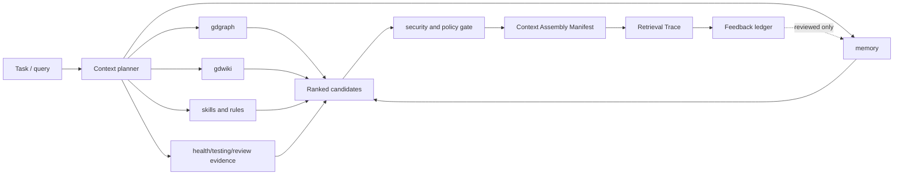

# Keryx Context Operations — Specification
Version: 1.0.0

## Identity and status

`context-operations` — будущая cross-cutting capability Keryx. Статус:
`future`; действующие модули остаются источниками доменной логики. Новый слой
только планирует, собирает, объясняет и оценивает контекст.

## Architecture



## Storage structure

```text
.metaproject/
  context.config.json                         # source config, seed-once
  data/context/
    assemblies/<assembly-id>.json             # generated, disposable receipt
    traces/<assembly-id>.json                 # generated, redacted trace
    feedback/<assembly-id>.jsonl              # append-only, policy guarded
    eval/<run-id>/{report.md,report.json}     # generated validation evidence
  memory/                                     # existing Markdown source of truth
  wiki/                                       # existing Markdown source of truth
```

`data/context/` не является источником решений. Он может быть удалён и
пересобран из commit, query, config и исходных artifacts. Write в `memory/`,
`wiki/`, `project-skills/` остаётся под их собственными guards.

## Configuration

```json
{
  "schemaVersion": "1.0",
  "enabled": false,
  "budget": { "maxBytes": 262144, "maxEstimatedTokens": 48000, "maxItems": 40 },
  "sources": { "graph": true, "wiki": true, "memory": true, "skills": true, "quality": true },
  "ranking": { "lexical": 0.35, "scope": 0.2, "freshness": 0.15, "trust": 0.2, "graph": 0.1 },
  "semantic": { "enabled": false, "provider": null },
  "externalAdapters": [],
  "feedback": { "requireReviewForPromotion": true }
}
```

Новая capability выключена по умолчанию. При `enabled=false` она не импортирует
optional packages, не открывает сеть и не изменяет поведение текущих команд.

## CLI and MCP surface

| Surface | Contract | Status |
|---|---|---|
| `keryx context assemble <query>` | Создаёт manifest/trace; возвращает bounded context и citations либо typed `context_overflow` | future |
| `keryx context explain <assembly-id>` | Показывает selected/dropped candidates и score | future |
| `keryx context feedback <assembly-id>` | Добавляет guarded feedback record | future |
| `keryx context eval --corpus <path>` | Запускает fixture corpus и публикует report | future |
| MCP `context_assemble`, `context_explain` | Read-only semantic parity с CLI | future |

`context feedback` никогда не создаёт accepted memory сам. Promotion происходит
через существующий memory lifecycle и explicit approval.

### Typed failure contract

Если required items не умещаются в хотя бы один budget, `assemble` не создаёт
partial successful manifest. Он возвращает schema-valid
[ContextError](schemas/context-error.schema.json) с `code: "context_overflow"`,
нарушенной размерностью (`bytes`, `estimated_tokens` или `items`), requested
budget и списком required source IDs. CLI и MCP обязаны нормализовать один и
тот же error object; raw/redacted content в ошибку не включается.

## Planner algorithm

1. Валидировать query/work-item и request budget.
2. Извлечь mandatory items: active security policy, applicable procedural
   rules, frozen flow acceptance criteria.
3. Получить source candidates из доступных существующих services. Источник,
   который unavailable/stale/invalid, фиксируется в trace, но не маскируется.
4. Отфильтровать по scope, status, temporal validity, trust и policy.
5. Рассчитать explainable deterministic score. Optional semantic и graph
   adapters могут только rerank сформированный candidate pool.
6. Собрать bounded manifest; mandatory policy items не вытесняются score.
   Успешный manifest записывает `projectRevision`, `configHash`, used-item
   accounting и `budgetStatus: "within-limits"`; service отдельно проверяет,
   что used values не превышают maxima.
7. Прогнать redaction/security gate, persist redacted receipt и trace.

## Data contracts

Схемы являются частью контракта и должны валидироваться Draft 2020-12:

- [ContextAssemblyManifest](schemas/context-assembly-manifest.schema.json)
- [ContextCandidate](schemas/context-candidate.schema.json)
- [RetrievalTrace](schemas/retrieval-trace.schema.json)
- [ContextError](schemas/context-error.schema.json)
- [ExternalAdapter](schemas/external-adapter.schema.json)

### Integration contract

- `gdgraph`: принимает только stored graph artifacts; graph distance — score
  component, не доказательство актуальности факта.
- `gdwiki`: принимаются accepted pages и validated drafts только с явным label.
- `memory`: default — accepted/current entries; draft/conflict видны только при
  explicit diagnostics request.
- `gdskills`: procedural instructions попадают в manifest с version и
  verification status.
- `security`: единый choke point редактирует tool output и блокирует
  запрещённые write intents в enforced/CI modes.
- `flow`: mandatory constraints и acceptance criteria добавляются до ranking.
- external adapter: descriptor обязан иметь immutable `id`, `mode`, namespace,
  retention, provenance strategy и enabled flag. В R0/R1 adapter не получает
  write authority; сетевой adapter выключен по умолчанию и проходит отдельный
  capability/policy gate.

## Acceptance criteria

- **AC-1 / CO-1–4:** assembler создаёт schema-valid manifest, где у всех
  selected items есть source reference/hash и причина выбора.
- **AC-2 / CO-5–6:** disabled floor byte-identical; optional provider не
  вызывается, пока capability выключена или assets не проверены.
- **AC-3 / CO-7–9:** feedback и untrusted text не могут напрямую повысить
  knowledge до accepted/procedural/skill.
- **AC-4 / CO-10:** CLI/MCP parity fixtures дают одинаковый normalized manifest
  и trace, кроме transport metadata.
- **AC-5 / CO-11:** каждый adapter имеет explicit config, source namespace,
  retention и provenance; network adapter off by default.
- **AC-6 / CO-12–13:** documented checkout invocation работает; corpus suite,
  schemas и reports проходят в CI.
- **AC-7 / CO-3:** byte/token/item budget overflows возвращают typed
  `context_overflow`, сохраняют required source IDs и никогда не выдают
  partial-success manifest.
