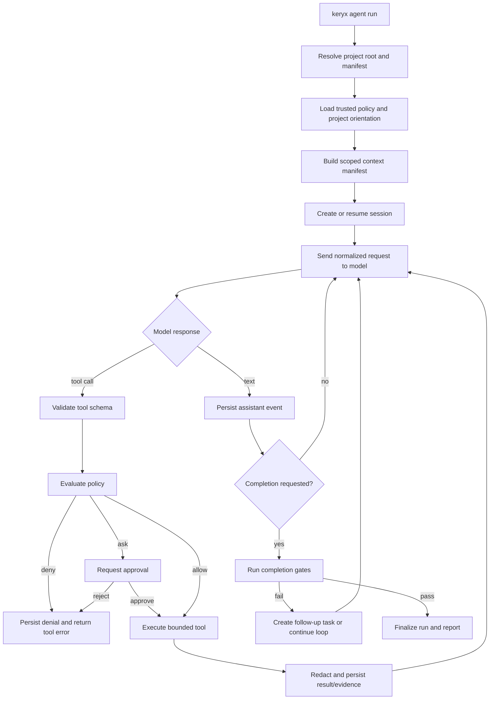

# Keryx Project Agent Harness Specification
Version: 0.4.0

## Identity

| Field | Value |
|---|---|
| Name | `keryx-project-agent-harness` |
| Kind | standard capability / core runtime |
| Status | draft — contract remediation; future implementation |
| Product role | project-oriented agent operating system |
| State owner | `.metaproject/` plus declared session roots |
| Runtime owner | Keryx harness core |
| Default mode | disabled; deterministic Keryx floor unchanged |
| Primary transport | CLI; JSONL/RPC is required for headless use |

## Design Principles

1. **Project over session.** Project artifacts outlive any model session.
2. **Provider neutrality.** Models reason; Keryx owns tools, policy, state, and
   evidence.
3. **Explicit authority.** Every action has a tool identity, policy decision,
   approval state, and provenance.
4. **Evidence over assertion.** Completion is a gate evaluation, not a final
   paragraph.
5. **Deterministic floor, opt-in ceiling.** Existing offline commands remain
   independent of the model runtime.
6. **Compose existing modules.** Harness code consumes service facades and
   artifacts; it does not duplicate graph, wiki, health, testing, memory,
   security, or flow logic.
7. **Append-only history.** Events and attempts are preserved; current views
   are derived.
8. **Bounded autonomy.** Budgets, concurrency, retries, approvals, and loop
   detectors are mandatory controls.

## Architectural Position

```text
Presentation
  CLI / JSONL / RPC / future TUI
        │
Application
  harness execution services / flow bridge / completion-gate artifact producer
        │
Domain
  turns / tool calls / policy decisions / sessions / tasks / evidence
        │
Infrastructure
  model providers / filesystem / subprocess / sandbox / network / git
        │
Existing Keryx service adapters
  gdgraph, gdctx, gdwiki, memory, skills, testing, health, security, flow
```

The runtime must not make domain types depend on a provider SDK, terminal UI,
MCP SDK, or a specific subprocess implementation. Provider, transport, and
existing-Keryx service adapters depend inward on runtime ports.

## Canonical Ownership and Import Direction

The package specifies one authority for each concern. A harness implementation
must not recreate Task Manager planning, retries, review/fix lifecycle, or the
completion transition.

| Concern | Sole owner | Harness responsibility | Forbidden harness behavior |
|---|---|---|---|
| Managed-flow task state, dependencies, dispositions, retries, review/fix lifecycle | `flow-orchestrator` and Task Manager | Supply typed execution evidence and gate artifacts | A second plan/execute/verify/review loop or direct `flow.json` write |
| Session, event, tool, provider, policy, and evidence primitives | Harness | Create/validate/persist its own runtime records | Advance Task Manager state directly |
| Completion transition for a managed flow | Task Manager | Produce a typed completion-gate result for consumption | Declare or persist managed-flow completion itself |
| Project brain | Existing Keryx modules | Consume through application ports | Copy or replace graph/wiki/memory/testing/health/flow ownership |
| Provider and transport integration | Adapter layer | Normalize to ports and durable contracts | Leak SDK or wire types into domain contracts |

| Domain/application port | Inbound consumer | Adapter implementations | Direction |
|---|---|---|---|
| `ContextProvider` | harness context service | graph, ctx, wiki, memory, testing, health adapters | adapter → port |
| `ProviderPort` | model loop | fake provider; future real-provider capability | adapter → port |
| `ToolExecutorPort` | tool runtime | registered read-only tool; later filesystem/shell/network adapters | adapter → port |
| `SessionStorePort` | session service | local append-only persistence adapter | adapter → port |
| `PolicyPort` | policy service | policy-profile, approval, security adapters | adapter → port |
| `ManagedFlowPort` | flow bridge | Task Manager API adapter | adapter → port |
| `CompletionGatePort` | completion service | evidence/gate evaluator | adapter → port |

## Planned Module Map

The final directory names may change during implementation, but ownership must
remain equivalent:

```text
src/harness/                    # reserved future agent-runtime namespace
  core/                         # pure state transitions and loop decisions
  model/                        # provider interface and adapters
  session/                      # append-only session tree and compaction
  tools/                        # tool definitions, registry, execution
  policy/                       # allow/ask/deny and approval evaluation
  context/                      # project context pack assembly
  roles/                        # primary and child agent profiles
  execution/                    # local turn state machine only; no managed-flow coordination
    turn-control/               # provider/tool turn loop and bounded continuation
  evidence/                     # provenance, artifacts, completion evidence
  transport/                    # CLI, JSONL/RPC, future TUI
  persistence/                  # atomic writes, locks, migrations
src/eval/                       # required target for current corpus harness
```

The `execution/turn-control` module is deliberately not a second
orchestrator. It may sequence one harness turn, persist its own runtime
attempt, and emit typed evidence. It must not create managed-flow tasks,
schedule review/fix waves, retry Task Manager work, or write `flow.json`.
Those operations are calls through `ManagedFlowPort` to the existing
`flow-orchestrator`/Task Manager authority. Any implementation that introduces
`orchestration/`, `plan/execute/verify` ownership, or a second completion loop
fails the architecture gate.

Before reserving `src/harness/`, the existing fixture-corpus evaluator moves to
`src/eval/` with an explicitly specified compatibility/import migration and
green corpus tests. This is an implementation prerequisite, not a runtime
claim in this documentation package.

## Runtime Lifecycle



The coordinator must persist an event before acknowledging the corresponding
state transition. A process crash may leave an in-progress run, but it must
never create an accepted completion without durable evidence.

## Core Runtime Contracts

### Model Provider

The normalized provider contract must support:

- model identity and provider identity;
- request with system/project context, messages, tool definitions, model
  options, budget, and cancellation signal;
- streamed text, reasoning metadata only when explicitly safe to persist,
  tool-call deltas, usage, finish reason, and provider errors;
- capability negotiation for tools, parallel calls, streaming, structured
  output, prompt caching, vision, and model selection;
- typed error classification: authentication, invalid request, rate limit,
  overloaded/transient, context overflow, unavailable, cancelled, unknown;
- retry hints and provider request id when available.

See [Provider Protocol](provider-protocol.md) and
`schemas/harness-event.schema.json`.

Compatibility policy is machine-readable in
`schemas/schema-version-registry.json`: every durable schema declares its
stored version, accepted range, migration id, and typed rejection behavior.
The deprecated `harness-agent-task` entry is migration-reader-only and is not
an active transport or fixture family.

### Tool Definition

Each tool must declare:

- stable namespaced id, version, and description;
- JSON input schema and bounded output contract;
- read/write/network/subprocess/credential classification;
- required permission capability and default risk level;
- timeout, output byte/token limit, concurrency key, and cancellation support;
- implementation via an injected service or infrastructure adapter;
- provenance fields for project root, worktree, session, turn, and tool call;
- whether execution is deterministic/replayable.

The initial built-in registry should include:

| Tool family | Tools | Source of truth | Release |
|---|---|---|---|
| Files | `read`, `glob`, `grep` | harness boundary; reuse `gdctx` for compact reads where applicable | Release 0 |
| Files | `edit`, `write`, `patch` | guarded filesystem adapter with receipts | Release 1 |
| Shell | `bash` / `command` | isolated subprocess adapter with policy and limits | Release 1, isolation required |
| Project graph | `gdgraph.find`, `gdgraph.affected`, `gdgraph.symbol`, `gdgraph.path` | `src/gdgraph` service | Release 0 |
| Context | `gdctx.read`, `gdctx.rg`, `gdctx.run` | `src/ctx` / command facade | Release 0, read-only |
| Knowledge | `wiki.query`, `memory.search`, `memory.relevant` | `src/wiki`, `src/memory` | Release 0, read-only |
| Work | `flow.status`, `flow.task`, `flow.ac`, `review.status` | `src/flow`, `src/review` | Release 1, Task Manager API only |
| Verification | `test.run`, `health.run`, `health.gate`, `security.check` | existing services | Release 0, evidence only |
| Delegation | `agent.spawn` | harness adapter over canonical child contracts | Release 2 |

Tools that mutate source files must use atomic writes, security checks, and
evidence capture. The model must not receive direct filesystem or shell access
outside registered tools.

### Policy Decision

Every tool call resolves to exactly one of:

- `allow` — execute automatically;
- `ask` — pause and request user approval;
- `deny` — do not execute and return a typed policy result.

Rules are evaluated in deterministic order: hard deny, session deny, role
deny, project policy, user override, tool default. The last matching rule is
not sufficient by itself: hard security denies always win.

### Session

A session is an append-only tree of entries. Every entry has a stable id,
parent id, timestamp, type, provenance, and redacted payload. Required entry
types are:

- `session_start`, `user_message`, `assistant_message`;
- `model_request`, `model_event`, `model_response`;
- `tool_call`, `policy_decision`, `approval_request`, `approval_result`;
- `tool_result`, `artifact_written`, `evidence_link`;
- `compaction`, `branch_summary`, `retry`, `error`, `checkpoint`;
- `run_pause`, `run_resume`, `run_end`.

Session files must support an append cursor and a current leaf. Compaction must
preserve file read/modify history and never remove the evidence ledger.

## Project Context Contract

The project context builder is a `ContextProvider` composition. Each provider
implements collect, validate, freshness assessment, and bounded render. The
selection order is policy/rules, active flow and acceptance criteria, graph and
scope, durable knowledge, testing/health/security evidence, then optional
research. Every selected, omitted, empty, or degraded source produces a typed
manifest record; runtime/session context is separate from durable project
knowledge.

It creates a `context-manifest.json` before the first model request. It contains:

- project root and worktree identity;
- manifest and enabled module fingerprints;
- orientation/rules references;
- selected graph scope and affected files;
- compact context artifacts from `gdctx`;
- relevant wiki and memory references;
- testing/health/security baseline references;
- active flow and acceptance criteria references;
- byte/token estimates, hashes, freshness, and redaction status.

The model prompt receives a bounded rendered view plus references. It must not
receive all `.metaproject/data/` or all repository files by default.

## Agent Roles

Initial roles:

| Role | Default access | Purpose |
|---|---|---|
| `plan` | read-only project tools, no edits | clarify scope, risks, plan, and AC |
| `build` | read/write with ask policy | implement accepted plan |
| `review` | read-only, tests allowed, no edits | inspect correctness and risks |
| `verify` | read-only plus test/health/security execution | produce evidence |
| `research` | read-only, optional web/network ask | investigate external material |
| `orchestrator` | task/flow/delegation tools, no direct source edits by default | coordinate child agents |

Roles are configuration/data, not hard-coded prompt-only behavior. Each role
has a policy fingerprint and tool allowlist. A role cannot grant itself more
authority.

## Child Agent Model

Child agents are new harness sessions or isolated runtime instances with:

- parent run/session/task ids;
- explicit role and objective;
- compact context references;
- frozen acceptance criteria;
- tool allowlist and policy;
- model/provider policy;
- token/time/concurrency budget;
- output contract and artifact destination;
- status protocol (`DONE`, `DONE_WITH_CONCERNS`, `BLOCKED`,
  `NEEDS_CONTEXT`, `FAILED`).

Child agents must return schema-valid `subagent-result` messages. The existing
Keryx contracts remain the inter-agent compatibility layer.

## Orchestration Model

The harness supports these modes, but only the first is in Release 0:

1. **Interactive turn** — one session, user steering, bounded tool calls.
2. **Managed flow** — a future Task Manager-owned flow that consumes harness
   evidence and controls task state and completion.
3. **Plan/execute/verify** — a future non-managed staged mode, never a shadow
   coordinator for a managed flow.
4. **Parallel wave** — deferred until canonical child contracts, isolation, and
   aggregate budget rules are implemented.
5. **Review/fix loop** — owned by the selected coordinator; the harness only
   records the evidence it produces.

Only one loop authority may own a managed run: `flow-orchestrator`/Task Manager.
The harness owns primitive execution decisions within a dispatched run but not
managed task state, retry policy, review/fix workflow, or completion.

## Completion Gates

The completion policy is configurable by run kind, but implementation flows
must support:

- acceptance criteria frozen and intact;
- required tasks terminal or explicitly dispositioned;
- changed files and artifacts recorded;
- focused tests complete and normalized;
- health gate evaluated with baseline status;
- security output/input checks passed or explicitly approved;
- required review complete;
- blocker/major findings decided;
- no active retry or approval request;
- output and event records schema-valid;
- final summary contains evidence references, not unsupported claims.

The gate result is a typed object and is persisted before run finalization.

## Storage Structure

The exact root is configurable, but the default project-oriented layout is:

```text
.metaproject/
  harness/
    harness.config.json
    roles/
    policies/
    tools/
  data/harness/
    sessions/<session-id>/
      session.jsonl
      manifest.json
      context-manifest.json
      events.jsonl
      evidence.jsonl
      checkpoints/
      branches/
      artifacts/
      output.json
    runs/<run-id>/
      input.json
      output.json
      metrics.json
      events.jsonl
    cache/
      contexts/<context-hash>.json
      tool-results/<tool-key>.json
```

Project policy and role definitions are source-of-truth files. Session/run
records are generated artifacts. Sensitive content is redacted before it is
written to either class.

## Manifest and Configuration

The existing `.metaproject/metaproject.json` remains authoritative for module
enablement. The harness adds an optional module entry and a dedicated config:

```json
{
  "harness": {
    "enabled": false,
    "config": ".metaproject/harness/harness.config.json",
    "data": ".metaproject/data/harness",
    "defaultRole": "build",
    "defaultProvider": "anthropic",
    "policyProfile": "ask-on-mutation",
    "maxConcurrentChildren": 2,
    "maxRunSeconds": 3600,
    "persistSessions": true
  }
}
```

The default harness capability is off. Enabling it must be explicit and must
not enable network, shell, writes, or child agents without corresponding policy
configuration.

## CLI Surface

Planned user-level commands:

```text
keryx agent [run] [--role <role>] [--provider <provider>] [--model <model>]
keryx agent run --prompt <text> [--flow <id>] [--session <id>]
keryx agent resume <session-id>
keryx agent status <run-id|session-id>
keryx agent stop <run-id>
keryx agent approve <approval-id>
keryx agent deny <approval-id> [--reason <reason>]
keryx agent tools list
keryx agent roles list
keryx agent policy check <tool-call.json>
keryx agent session list
keryx agent session branch <session-id> [--name <name>]
keryx agent context build [--flow <id>] [--scope <path>]
keryx agent replay <run-id> [--offline]
keryx agent verify <run-id>
keryx agent serve --mode rpc
```

Exact spelling may be refined during implementation, but the semantic surface
must exist. CLI handlers remain thin and delegate to service functions.

## Error and Recovery Contracts

Recoverable failures must be typed and persisted as events. The runtime must
distinguish:

- `validation_error` — malformed user/model/tool input;
- `policy_denied` — action blocked by policy;
- `approval_rejected` — user declined;
- `tool_failed` — tool execution failure;
- `provider_transient` — retryable provider condition;
- `provider_permanent` — non-retryable provider condition;
- `context_overflow` — context budget failure;
- `budget_exceeded` — run cannot continue safely;
- `loop_detected` — repeated ineffective action;
- `cancelled` — user/system cancellation;
- `environment_blocked` — missing command/dependency/permission.

Each error includes action, retryability, cause chain where safe, and next
operator action. No empty catch or silent fallback is permitted.

## Security Boundary

The harness must use a stricter security facade at every durable or external
seam; the existing security module is an adapter input, not proof of a safe
boundary. Scan or redaction failure is blocking for provider-bound, durable,
external, and mutation paths. Three profiles exist: `read-only-review`,
`monitored-trusted-local`, and `unattended-untrusted`; Release 0 permits only
`read-only-review`. A permission prompt is not a sandbox boundary.

At minimum it must provide:

- prompt/content scanning for untrusted instructions;
- secret and PII redaction before persistence;
- command/path/network policy checks;
- explicit external-directory control;
- environment-variable allowlist rather than full environment inheritance;
- required OS/container/remote isolation for unattended/untrusted mutation;
- safe cancellation and child-process termination;
- no direct model access to credentials unless a tool explicitly mediates it.

Network access, when introduced after Release 0, must pass through a broker that
validates scheme/port, DNS resolution, redirect targets, private/link-local/
metadata addresses, proxy/Unix-socket policy, and size/time budgets. URL-text
detection remains defense in depth, not network enforcement. See
[Security Protocol](security-protocol.md).

## External Protocols

MCP may expose Keryx tools/resources to external clients. It must not become
the internal runtime abstraction. The internal tool contract should be
adaptable to MCP, JSONL/RPC, and direct in-process calls. MCP exposure remains
read-only by default; mutating tools require separate policy and approval.

## Acceptance Criteria

The detailed behavioral contract is in [acceptance.feature](acceptance.feature).
The following are mandatory release gates:

- all core schemas validate valid and invalid fixtures;
- the deterministic floor passes with harness disabled;
- a provider fixture can drive a complete tool-call loop offline;
- policy tests cover allow/ask/deny and hard-deny precedence;
- session replay reproduces state transitions and tool decisions;
- resume does not duplicate accepted events or evidence;
- child-agent dispatch uses valid existing worker contracts;
- completion rejects missing evidence and unresolved blockers;
- security tests prove redaction and path/command boundary enforcement;
- docs and roadmap status remain `future` until source and tests prove the
  runtime exists.

## Referenced Schemas

- [Harness config](schemas/harness-config.schema.json)
- [Run input](schemas/harness-run-input.schema.json)
- [Event](schemas/harness-event.schema.json)
- [Tool call](schemas/harness-tool-call.schema.json)
- [Policy decision](schemas/harness-policy-decision.schema.json)
- [Agent task](schemas/harness-agent-task.schema.json)
- [Context manifest](schemas/harness-context-manifest.schema.json)
- [Run output](schemas/harness-run-output.schema.json)

## Normative Contract Registry

The complete owner/persistence/producer/consumer/migration/fixture inventory is
maintained in the remediation job's `contract-inventory.md`. The package schema
registry is grouped below; every file uses a stable `$id`, `schemaVersion`, and
Draft 2020-12 declaration. JSON Schema validation is supplemented by semantic
checks for causal ordering, state transitions, hashes, budgets, and cross-record
reachability.

| Contract family | Schemas |
|---|---|
| Shared envelope and runtime | `harness-envelope`, `harness-config`, `harness-run-input`, `harness-run-output`, `rpc-jsonl-envelope` |
| Context, session, and evidence | `harness-context-manifest`, `session-manifest`, `session-entry`, `checkpoint`, `branch-metadata`, `compaction-entry`, `evidence-record`, `evidence-ledger` |
| Provider/model | `provider-descriptor`, `model-request`, `model-response`, `model-error`, `fake-provider-transcript` |
| Tools and recovery | `tool-definition`, `tool-registry-snapshot`, `harness-tool-call`, `tool-execution-state`, `tool-result`, `execution-receipt`, `replay-fixture`, `replay-mismatch` |
| Policy, approval, completion | `policy-profile`, `harness-policy-decision`, `approval-request`, `approval-result`, `completion-gate-result` |
| Child contracts | `harness-child-contract-extension`; `harness-agent-task` is deprecated and is not a canonical source of truth |

Durable payloads are persisted under the local Keryx session/run roots. Every
schema change requires a version bump or explicit compatible migration fixture;
stable identifiers and evidence references must survive migration. Release 0
fixtures are offline and read-only. Replay fixtures bind tool definition,
registry, input, and expected output hashes and cannot authorize a live effect.
